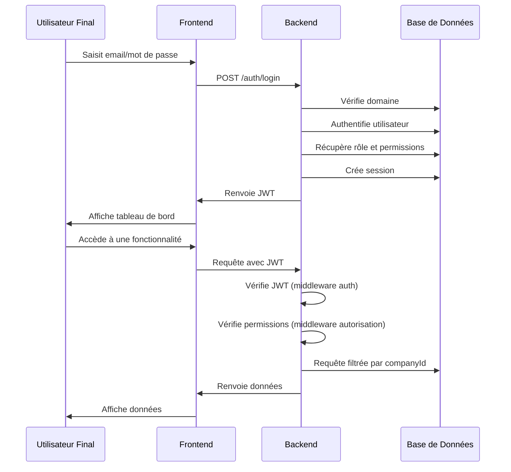

# Cas d'Utilisation pour l'Authentification et l'Autorisation B2B

Ce dossier contient les cas d'utilisation détaillés pour le système d'authentification et d'autorisation B2B de l'application Factory SA.

## Acteurs

- **Administrateur Système (AS)** : Gère les entités globales (Entreprises, Domaines, Rôles, Permissions) via AdminJS.
- **Administrateur d'Entreprise (AE)** : Utilisateur avec le rôle `MANAGER` ou `ADMIN` au sein d'une `Company`, gère les utilisateurs de son entreprise via AdminJS ou une future interface.
- **Utilisateur Final (UF)** : Utilisateur de l'application, accède aux fonctionnalités selon ses permissions.

## Liste des Cas d'Utilisation

1. [UC1 : Configuration Initiale par l'Administrateur Système](./UC1_ConfigurationInitiale.md)
2. [UC2 : Connexion d'un Utilisateur Final](./UC2_ConnexionUtilisateur.md)
3. [UC3 : Accès à une Fonctionnalité Protégée](./UC3_AccesFonctionnaliteProtegee.md)
4. [UC4 : Gestion des Utilisateurs par un Administrateur d'Entreprise](./UC4_GestionUtilisateurs.md)

## Modèle de Données

Le système d'authentification et d'autorisation repose sur les modèles de données suivants :

- **`Company` (Entreprise)** : Représente une entreprise cliente B2B.
- **`Domain` (Domaine)** : Représente un domaine email autorisé pour l'authentification.
- **`CompanyDomain` (Domaine d'Entreprise)** : Associe un domaine à une entreprise.
- **`User` (Utilisateur)** : Représente un utilisateur de l'application.
- **`Role` (Rôle)** : Définit un ensemble de permissions.
- **`Permission` (Permission)** : Représente une action spécifique sur une ressource.
- **`RolePermission` (Permission de Rôle)** : Associe une permission à un rôle.
- **`UserRole` (Rôle Utilisateur)** : Associe un utilisateur à une entreprise avec un rôle spécifique.
- **`Session` (Session)** : Représente une session utilisateur active.

## Diagramme de Flux

