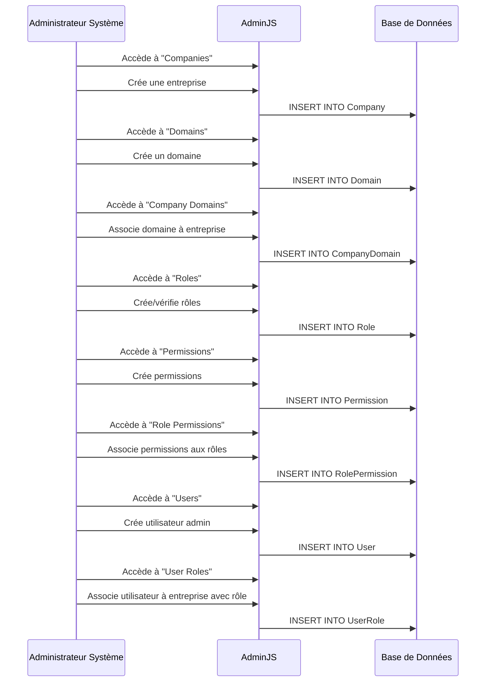

# UC1 : Configuration Initiale par l'Administrateur Système

## Description

L'Administrateur Système (AS) configure une nouvelle entreprise, ses domaines autorisés, et les rôles/permissions de base.

## Préconditions

- L'AS est connecté à AdminJS.
- Les modèles Prisma (`Company`, `Domain`, `Role`, `Permission`, `CompanyDomain`, `RolePermission`) sont définis et migrés.

## Flux Principal

1.  L'AS navigue vers la section "Companies" dans AdminJS.
2.  L'AS clique sur "Créer une nouvelle entreprise".
3.  L'AS remplit les détails de l'entreprise (Nom: "Tech Solutions", Description: "Fournisseur de services IT").
4.  L'AS navigue vers la section "Domains".
5.  L'AS clique sur "Créer un nouveau domaine".
6.  L'AS entre le nom du domaine (ex: "techsolutions.com") et le marque comme actif.
7.  L'AS navigue vers la section "Company Domains".
8.  L'AS clique sur "Créer une nouvelle association".
9.  L'AS sélectionne "Tech Solutions" et "techsolutions.com" pour créer la liaison.
10. L'AS navigue vers la section "Roles".
11. L'AS s'assure que les rôles par défaut (`ADMIN`, `MANAGER`, `USER`) existent ou les crée si nécessaire.
12. L'AS navigue vers la section "Permissions".
13. L'AS crée les permissions nécessaires (ex: `packing_list:read`, `packing_list:create`, `user:manage`, `company:read`).
14. L'AS navigue vers la section "Role Permissions".
15. L'AS associe les permissions aux rôles (ex: `MANAGER` a `packing_list:read`, `packing_list:create`, `user:manage`).
16. L'AS navigue vers la section "Users".
17. L'AS clique sur "Créer un nouvel utilisateur".
18. L'AS remplit les détails de l'utilisateur (Email: `admin@techsolutions.com`, Mot de passe: `password123`, Prénom: "Admin", Nom: "Tech").
19. L'AS navigue vers la section "User Roles".
20. L'AS clique sur "Créer une nouvelle association".
21. L'AS sélectionne l'utilisateur `admin@techsolutions.com`, la compagnie "Tech Solutions" et le rôle `ADMIN`.

## Post-conditions

- Une nouvelle `Company` est créée et active.
- Un `Domain` est créé et lié à la `Company`.
- Les `Role`s et `Permission`s sont définis.
- Un `User` initial est créé et associé à la `Company` avec un `Role` spécifique.

## Diagramme de Séquence

### Configuration AdminJS

La configuration AdminJS devra inclure ces modèles et définir les droits d'accès appropriés.
