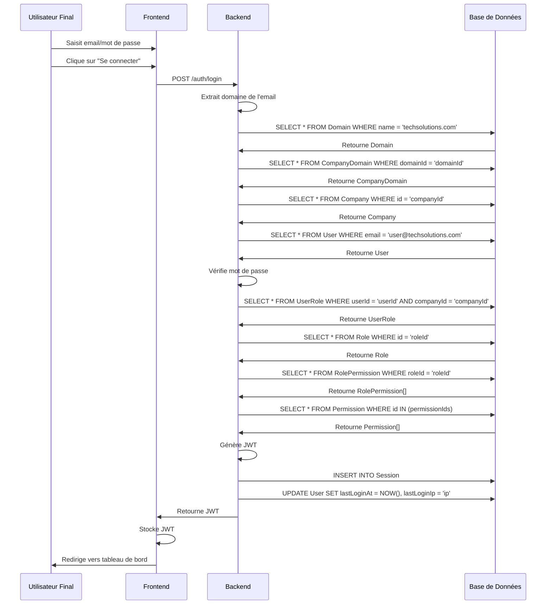

# UC2 : Connexion d'un Utilisateur Final

## Description

Un utilisateur se connecte à l'application avec son email et mot de passe.

## Préconditions

- L'application backend est en cours d'exécution.
- Un `User` existe dans la base de données, associé à une `Company` et un `Domain` via `CompanyDomain`.

## Flux Principal

1.  L'Utilisateur Final (UF) accède à la page de connexion de l'application.
2.  L'UF entre son email (ex: `user@techsolutions.com`) et son mot de passe.
3.  L'UF clique sur "Se connecter".
4.  Le frontend envoie une requête `POST /auth/login` avec `{ email: "user@techsolutions.com", password: "userpass" }`.
5.  **Backend - Validation du Domaine :**
    - Le backend extrait le domaine (`techsolutions.com`) de l'email.
    - Il recherche le `Domain` correspondant et vérifie son statut `isActive`.
    - Il recherche la `CompanyDomain` associée à ce `Domain` et récupère le `companyId` (ex: `techSolutionsId`)
    - Si le domaine n'est pas trouvé ou n'est pas actif, ou s'il n'est pas lié à une entreprise active, la connexion échoue.
6.  **Backend - Authentification de l'Utilisateur :**
    - Le backend recherche l'`User` avec l'email `user@techsolutions.com`.
    - Il compare le mot de passe fourni avec le hachage stocké.
    - Si les identifiants sont incorrects, la connexion échoue.
7.  **Backend - Récupération du Rôle et des Permissions :**
    - Le backend recherche le `UserRole` pour cet `User` et ce `companyId` (`techSolutionsId`).
    - Il récupère le `Role` associé (ex: "Employee").
    - Il récupère toutes les `Permission`s associées à ce `Role` via `RolePermission`.
8.  **Backend - Génération du JWT et de la Session :**
    - Un JWT est généré, encodant l'`userId`, l'`companyId`, le `roleId` et la liste des `Permission`s.
    - Une `Session` est créée dans la base de données avec le token JWT et sa date d'expiration.
    - Les champs `lastLoginAt` et `lastLoginIp` de l'`User` sont mis à jour.
9.  **Backend - Réponse :**
    - Le backend renvoie une réponse 200 OK avec le JWT (dans un cookie `HttpOnly` ou dans le corps de la réponse).
10. **Frontend :**
    - Le frontend stocke le JWT et redirige l'UF vers le tableau de bord de l'application.

## Post-conditions

- L'UF est authentifié et a un JWT valide.
- Une `Session` est enregistrée pour l'UF.
- `lastLoginAt` et `lastLoginIp` de l'UF sont mis à jour.

## Flux Alternatifs

- **UC2.1 : Email ou Mot de Passe Incorrect** : Le backend renvoie une erreur 401 Unauthorized.
- **UC2.2 : Domaine Non Autorisé/Inactif** : Le backend renvoie une erreur 403 Forbidden ou 401 Unauthorized.
- **UC2.3 : Utilisateur Inactif** : Le backend renvoie une erreur 403 Forbidden.

## Diagramme de Séquence

