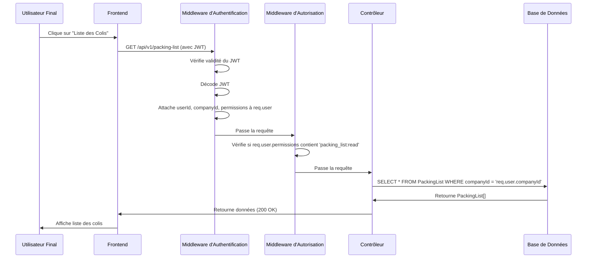

# UC3 : Accès à une Fonctionnalité Protégée

## Description

Un utilisateur authentifié tente d'accéder à une ressource nécessitant des permissions spécifiques.

## Préconditions

- L'Utilisateur Final (UF) est connecté et possède un JWT valide.
- Le JWT contient l'`userId`, l'`companyId`, le `roleId` et les `Permission`s de l'UF.

## Flux Principal

1.  L'UF clique sur un bouton pour afficher la liste des colis (ex: `GET /api/v1/packing-list`).
2.  Le frontend envoie la requête avec le JWT dans l'en-tête `Authorization` (ou via le cookie).
3.  **Backend - Middleware d'Authentification (`authenticate`):**
    - Le middleware intercepte la requête.
    - Il vérifie la validité du JWT (signature, expiration).
    - Il décode le JWT et attache l'`userId`, l'`companyId`, le `roleId` et les `Permission`s à `req.user`.
    - Si le JWT est invalide ou manquant, la requête est rejetée avec 401 Unauthorized.
4.  **Backend - Middleware d'Autorisation (`authorize('packing_list:read')`):**
    - Le middleware vérifie si `req.user.permissions` contient la permission `packing_list:read`.
    - Si la permission est présente, la requête continue vers le contrôleur.
    - Si la permission est absente, la requête est rejetée avec 403 Forbidden.
5.  **Backend - Contrôleur (`packingListController`):**
    - Le contrôleur exécute la logique métier.
    - Toutes les requêtes à la base de données pour les listes de colis sont filtrées par `companyId` (ex: `prisma.packingList.findMany({ where: { companyId: req.user.companyId } })`).
6.  **Backend - Réponse :**
    - Le backend renvoie la liste des colis de l'entreprise de l'UF avec un statut 200 OK.

## Post-conditions

- L'UF accède aux données autorisées et filtrées par son entreprise.

## Flux Alternatifs

- **UC3.1 : JWT Invalide/Manquant** : Le backend renvoie une erreur 401 Unauthorized.
- **UC3.2 : Permissions Insuffisantes** : Le backend renvoie une erreur 403 Forbidden.
- **UC3.3 : Accès à des Données d'une Autre Entreprise** : La logique de filtrage par `companyId` empêche l'accès, renvoyant un résultat vide ou une erreur si la requête est mal formée.

## Diagramme de Séquence

