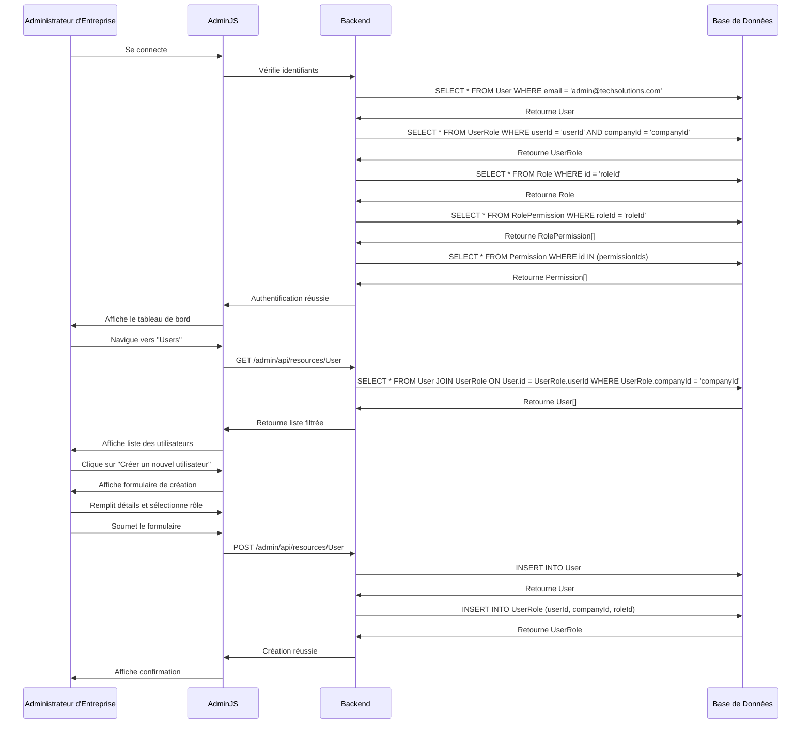

# UC4 : Gestion des Utilisateurs par un Administrateur d'Entreprise

## Description

Un Administrateur d'Entreprise (AE) gère les utilisateurs au sein de son entreprise via le back-office AdminJS.

## Préconditions

- L'AE est connecté à AdminJS.
- L'AE possède le rôle `MANAGER` ou `ADMIN` pour sa `Company`, avec la permission `user:manage`.

## Flux Principal

1.  L'AE se connecte à AdminJS (voir UC2).
2.  L'AE navigue vers la section "Users".
3.  AdminJS affiche la liste des utilisateurs.
    - **Filtrage Automatique :** AdminJS, via une configuration spécifique ou un hook, ne devrait afficher que les utilisateurs associés à la `Company` de l'AE.
4.  L'AE clique sur "Créer un nouvel utilisateur".
5.  L'AE remplit les détails du nouvel utilisateur (Email: `new.user@techsolutions.com`, Mot de passe: `newpass`).
6.  L'AE sélectionne le `Role` pour ce nouvel utilisateur (ex: "Employee").
7.  **Backend - Création de l'Utilisateur :**
    - AdminJS envoie la requête de création.
    - Le backend crée le `User`.
    - Le backend crée une entrée dans `UserRole` associant le nouvel `User` à la `Company` de l'AE et au `Role` sélectionné.
8.  L'AE peut également modifier un utilisateur existant, changer son rôle, ou le désactiver.

## Post-conditions

- Un nouvel `User` est créé et associé à la `Company` de l'AE avec le `Role` spécifié.
- Les modifications apportées aux utilisateurs sont enregistrées.

## Flux Alternatifs

- **UC4.1 : Permissions Insuffisantes** : Si l'AE n'a pas la permission `user:manage`, l'accès à la section "Users" ou aux actions de création/modification est refusé par AdminJS.

## Diagramme de Séquence

